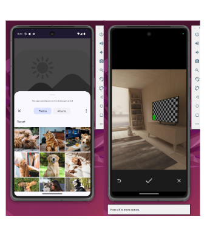

# Instamate
Instamate is a social media app that offers real-time interactive feeds, case-insensitive search and follow functionality, customizable user profiles, and seamless post creation with Firebase authentication and storage.

[Instamate .pdf](https://github.com/user-attachments/files/16790757/Instamate.pdf)

## Major subsystems Screenshots

#### Firebase User Authentication, Custom Register, Login and Sign Out Pages
New users can register for an account by entering the email, name and password which are mandatory and then clicking on the register button. Optionally, they can add a short bio or even add a profile image. These can be later changed in the App.  New user account is created using Firebase Authentication service. The sign-in also allows the user to navigate to the Login page if they already have an account. In the Login page, users are able to login with an authenticated email and password. User can also navigate to register page if they don’t have an account. 

 

#### Real-time Interactive Feed
This is the page that a user lands on after signing in. The  real-time interactive feed displays all their posts and those of other users that they follow. If you are viewing the feed when someone you follow makes a new post, then the new post is added to the top of the feed in real-time. Each post card shows a profile pic of the poster,their names, time of post, their post and number of likes along with a send button underneath. 
The like button (heart icon) functionality allows you to ‘like’ their post. The like counter is also updated in real-time whenever someone likes the post. The send button functionality allows you to share the post image uisng any of the applicable apps in the phone. 
The custom bottom app navigation menu has icons for Feed, Search, Post and Profile pages and allows you to navigate there by clicking the icon.
 

#### Case- Insensitive Search and Follow functionality
Clicking the search icon in the custom navbar at the bottom takes you to the search page where you can see a recycler view with a list of all existing users by default. Each user’s profile pic, their username and a button indicating whether you are currently following them or not is displayed. 
Real-time follow functionality: If you click the button to follow a user then the button changes color to grey and will display “Unfollow”. The posts of that user will also be displayed immediately in Feed without having to manually refresh. Similarly the follower count of that user and your own following count that are displayed in the respective profile pages will update in real-time as there is a shared mutable state. 
In the top search bar, you can search for a user by name and if you do an empty search all users are displayed. The search is also case-insensitive as can be seen in the image below. Since Firestore data and queries are always case-sensitive, in order to achieve this case-insensive search, I also stored a normalized name of each user and compared the search term against that.
 

#### New post

Clicking the post icon on navigation bar on the bottom takes you to the post fragment(1) where the user can make a new post. While a caption is optional, adding an image is mandatory. Clicking the image icon takes you an image fragment(2) where there are options to either take a picture using camera or upload from gallery. After choosing picture it becomes temporarily visible in the Image fragment for the user to preview(3). When upload button is clicked, the image is uploaded to firebase storage and the app returns to the post fragment where the image is previewed(3). The user can add an optional caption and click ‘post’ at which point the post is published and the pictureURL is linked to post. If the user clicks ‘cancel’, everything is discarded and user navigates to previous fragment.    

 *camera*
 

#### User profile
Clicking the profile icon in the app menu takes you to your profile page. Here your current profile picture, Name, email, bio and all your published posts are displayed. Also displayed are counts of the total posts, followers and following. These update in real-time as other users follow you or you follow or make posts. Also present is ‘logout’ button which takes you back to the SignUp and an ‘Edit My profile’ button. 
The Edit Profile button takes you to edit profile page where you can change the name, bio and profile picture. If you change your name or profile picture, these changes will also get reflected in real-time in all your posts on the feed page. To change the profile picture, you have to click the ‘blue plus which takes you back to the image fragment where you can use either the camera or gallery to select a picture. Since we are updating a profile picture the selected image will be displayed in a circular image view. By sending the fragment that you are coming from as an argument, the image fragment will know if it is profile picture or a post picture and automatically select the image view.    

 
 

## Noteworthy things about UI/UX 
- A logo page for 2 seconds before going to signup page.
- Third-party library (hdodenhof CircleImageView) to get the circular image view for profile pics.
- Glide to load images
- Used Material buttons and text fields  as their look and feel were much better
- Created a custom bottom navigation bar
- Realistic looking icons from flaticon.com
- Case-insensitive searching for the search bar was also created since it will be inconvenient and unrealistic to expect a user to type someone else’s name exactly as they typed it. By default, firestore doesnt have case-insensitive query so i created an all lower case form of the name(normalised) of all users against which to check the search term. 
 

## Backend or processing logic
I only have two collections, Users and Posts but I store in Posts the user name and profile image of the poster as I need it for the Feed and I can pull all the info from one collection. But since the user can edit their image or name, after the user successfully edits their info, I propagate these changes to all their posts in Posts collection. 
Below is the structure of my databases and storage: The key for Posts collection is a firestore ID generated by firestore. Timestamp is also generated by server. The key for Users collection is the userID. This is the same as the one generated when they use firebase authentication. 

 
 
 

